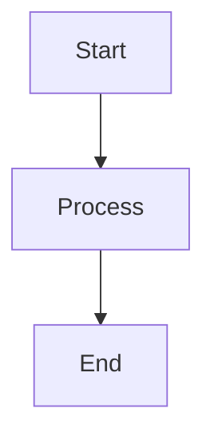
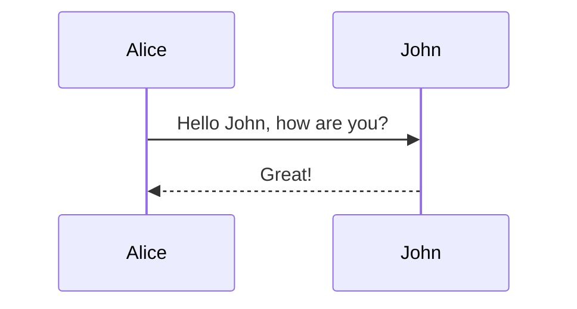
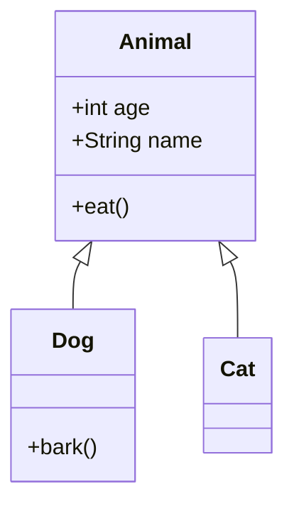
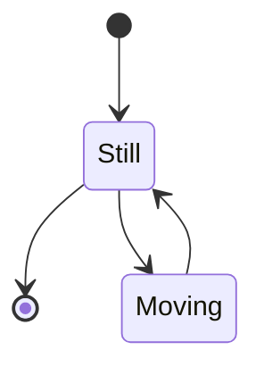
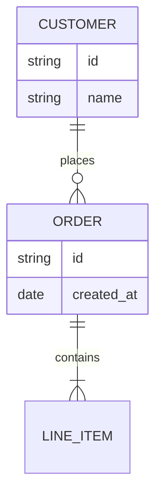
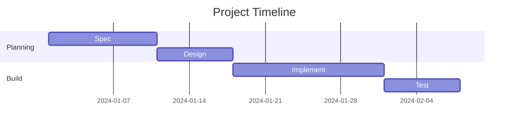
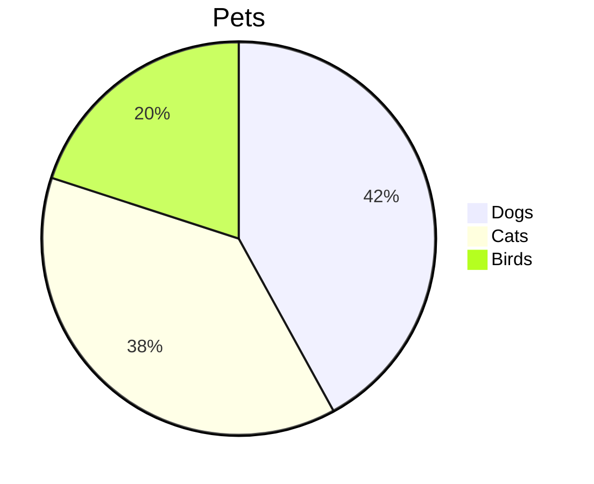
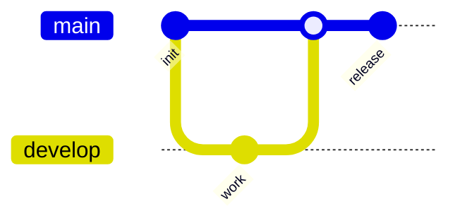

# Diagram Examples (Mermaid)

This blog supports rendering Mermaid diagrams directly from Markdown fenced code blocks.

## Flowchart

## Sequence Diagram

## Class Diagram

## State Diagram

## ER Diagram

## Gantt Chart

## Pie Chart

## Git Graph

## Best Practices

- Prefer short labels on mobile; long labels can overflow and require more panning.
- Keep diagrams focused: one concept per diagram.
- If a diagram fails to render, switch to "View Code" and validate the Mermaid syntax.

