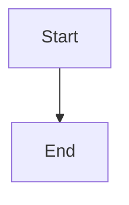

# CodeWithBotina Blog Frontend

[](https://astro.build)
[](https://tailwindcss.com)
[](../LICENSE)
[](https://blog.codewithbotina.com)

> High-performance, SEO-optimized static blog built with Astro and Supabase.

**Live Site:** [blog.codewithbotina.com](https://blog.codewithbotina.com)  
**API Backend:** [api.codewithbotina.com](https://api.codewithbotina.com)

---

## ✨ Features

- 🚀 Lightning-fast static site generation with Astro
- 🎨 Minimalist, responsive design (mobile, tablet, desktop, TV)
- 🔎 Global search with advanced filters
- 📝 Markdown-based content with syntax highlighting
- 📧 Contact form with backend API integration
- 🏷️ Intelligent tag system with tag pages
- 🍪 Cookie consent banner (GDPR/CCPA)
- 🌐 Bilingual i18n (English/Spanish) with language detection
- 🔐 SEO optimized (meta tags, Open Graph, Schema.org, hreflang)
- 🧭 Language-specific RSS feeds and sitemaps
- 📱 Fully responsive and accessible (WCAG AA)
- 🌍 Edge-deployed on Cloudflare Pages (global CDN)
- ⚡ Lighthouse score > 95 in all categories
- 📷 Drag-and-drop image uploads with preview (upload on submit only)
- ✅ Form validation with disabled submit until valid

---

## Search System

### Features

- Global search accessible from the header (search icon + modal)
- Advanced filters: date range
- Advanced filters: relevance (reactions, comments)
- Advanced filters: tags (popular tags + autocomplete, AND logic)
- Advanced filters: language (current/selected/all)
- Advanced filters: search scope (title/content/tags, with sequential fallback)
- Sequential search strategy (title -> content -> tags)
- Shareable search URLs (query params)
- Tag browsing improvements: search + sorting + pagination (20/50/100 per page)

### Components

- `src/components/search/SearchFilters.tsx` (shared UI)
- `src/components/search/GlobalSearchModal.tsx`
- `src/components/tags/TagSearchBar.tsx`

### Usage

Search is available on:

- Homepage (inline)
- Global header (modal)
- Tag pages (filter within tag)

All searches respect the current language by default unless overridden.

## Admin Features

## Markdown Content Features

Markdown content is enhanced automatically in published posts and in the admin preview.

### Diagram Rendering (Mermaid)

Use Mermaid fenced code blocks:

````markdown

````

Features:

- Toggle between diagram view and code view
- Pan and zoom (mouse + touch pinch-zoom)
- Download as PNG or SVG
- Fullscreen mode
- Lazy rendering (IntersectionObserver) and cached renders

Implementation:

- Library: Mermaid.js `11.14.0`
- Components: `src/components/markdown/DiagramRenderer.tsx`, `src/components/markdown/MarkdownEnhancer.tsx`

### Enhanced Tables

Markdown tables are rendered with:

- Visible cell borders and header styling
- Zebra striping and hover state
- Horizontal scrolling on mobile
- Copy-to-clipboard (Markdown, TSV, CSV)

Implementation:

- Component: `src/components/markdown/TableWrapper.tsx`
- Styling: `src/styles/global.css` (scoped to markdown tables via `.md-table`)

### Post Management

Administrators can create, edit, and delete posts directly from the frontend.

**Creating Posts:**
1. Navigate to homepage (must be logged in as admin)
2. Click "Create New Post" button
3. Select a primary language and optionally add translations (create multiple languages in one interface)
4. Fill in title/content for each selected language
5. Choose shared or per-language tags/images as needed
6. Preview content before publishing
7. Click "Create Post" and confirm

**Editing Posts:**
1. Navigate to post detail page (must be admin)
2. Click three-dot menu → "Edit Post"
3. If the post has linked translations, all versions load into a multi-language editor
4. Modify one or more versions (titles, slugs, content, tags, images)
5. Optionally add a new translation or unlink an existing translation
6. Click "Update Post" and confirm

**Deleting Posts:**
1. Navigate to post detail page (must be admin)
2. Click three-dot menu → "Delete Post"
3. Confirm deletion (WARNING: Deletes all comments and reactions)

### Image Uploads

When creating/editing posts, you can:
- Provide external image URL
- Upload image from device (drag-and-drop or click to browse)

Images are stored in Supabase Storage bucket: `blog-images`
Uploads only occur when you click Create/Update, preventing abandoned files.

### Tags & SEO

- Add 3–7 tags per post for better discoverability
- Tag landing pages at `/{lang}/tags/{slug}`
- Tags are injected into meta keywords and JSON-LD

### Admin Language Support

Admin editor supports English and Spanish routes:

- `/en/admin/create-post`
- `/es/admin/create-post`
- `/en/admin/edit-post/[slug]`
- `/es/admin/edit-post/[slug]`

---

## Multi-Language Post Editor

### Create Post Page

- Select a primary language.
- Optionally select additional translation languages.
- Fill fields per language section.
- Submit to create all language versions and link them via `post_translations`.

### Edit Post Page

- If translations are linked, the editor loads all linked versions.
- You can update multiple language records in one save.
- You can add a new translation (creates a new post record and links it).
- You can unlink a translation (removes the link but does not delete the post).

### Components

- `src/components/admin/MultiLanguagePostEditor.tsx`
- `src/components/admin/TagSelector.tsx`
- `src/components/admin/StorageImageGallery.tsx`

---

## 🏗️ Architecture

### Tech Stack

| Component | Technology | Version |
|-----------|------------|---------|
| Framework | Astro | 5.17.1 |
| Styling | Tailwind CSS | 4.1.18 |
| Database | Supabase (PostgreSQL) | Latest |
| Backend API | Deno Deploy | Fresh 1.7.3 |
| Deployment | Cloudflare Pages | Edge Runtime |
| Icons | Lucide Icons | Latest |

### Page Structure

```
blog.codewithbotina.com
├── /en/ (English home)
├── /es/ (Spanish home)
├── /{lang}/posts/[slug] (Post detail with Markdown rendering)
├── /{lang}/tags (All tags)
├── /{lang}/tags/[slug] (Tag landing page)
├── /{lang}/contact (Contact form)
├── /{lang}/about (About the author)
├── /{lang}/admin/create-post (Admin)
├── /{lang}/admin/edit-post/[slug] (Admin)
├── /{lang}/rss.xml (Language RSS feed)
├── /{lang}/sitemap.xml (Language sitemap)
└── /sitemap.xml (Sitemap index)
```

---

## 📁 Project Structure

```
frontend/
├── src/
│   ├── components/       # Reusable Astro components
│   ├── pages/           # Route pages
│   ├── lib/             # Utilities and configurations
│   ├── styles/          # Global CSS
│   └── types/           # TypeScript definitions
├── public/              # Static assets
├── tests/               # Test suite
└── astro.config.mjs
```

---

## 🛠️ Development Setup

### Prerequisites

- [Node.js](https://nodejs.org/) 22+ installed
- Supabase account with project created
- Code editor (VS Code recommended)

### Installation

1. **Clone the repository:**
```bash
git clone https://github.com/yourusername/codewithbotina-blog.git
cd codewithbotina-blog/frontend
```

2. **Install dependencies:**
```bash
npm install
```

3. **Configure environment variables:**
```bash
cp .env.example .env
nano .env  # Edit with your Supabase credentials
```

4. **Run development server:**
```bash
npm run dev
```

5. **Access locally:**
Open [http://localhost:4321](http://localhost:4321)

---

## 🧪 Testing

### Run Tests

```bash
# Run all tests
npm run test

# Run tests in watch mode
npm run test:watch

# Run tests with UI
npm run test:ui

# Generate coverage report
npm run test:coverage
```

---

## 🚢 Deployment

See [DEPLOYMENT.md](DEPLOYMENT.md) for complete deployment instructions for Cloudflare Pages (2026).

**Quick Deploy:**
1. Push to GitHub
2. Connect repository to Cloudflare Pages
3. Configure environment variables in the Cloudflare dashboard
4. Deploy automatically on every push to main

**Live Site:** [blog.codewithbotina.com](https://blog.codewithbotina.com)

---

## 🔐 Environment Variables

See `.env.example` for a complete list and descriptions.

**Required for Production:**
- `PUBLIC_SUPABASE_URL`
- `PUBLIC_SUPABASE_ANON_KEY`
- `PUBLIC_API_URL`
- `PUBLIC_SITE_URL`

---

## 📊 Performance

- Lighthouse Performance: 95+
- Lighthouse Accessibility: 100
- Lighthouse Best Practices: 100
- Lighthouse SEO: 100

---

## 🤝 Contributing

This is a personal project, but feedback is welcome!

- Email: support@codewithbotina.com

---

## 📄 License

MIT License - see [LICENSE](../LICENSE) file for details.

---

## 👤 Author

**Diego Alejandro Botina**
- Website: [blog.codewithbotina.com](https://blog.codewithbotina.com)
- Portfolio: [portfolio.codewithbotina.com](https://portfolio.codewithbotina.com)
- GitHub: [@CodeWithBotinaOficial](https://github.com/CodeWithBotinaOficial)
- LinkedIn: [codewithbotinaoficial](https://www.linkedin.com/in/codewithbotinaoficial)

---

**Built with ❤️ using Astro, Tailwind CSS, and Supabase**
